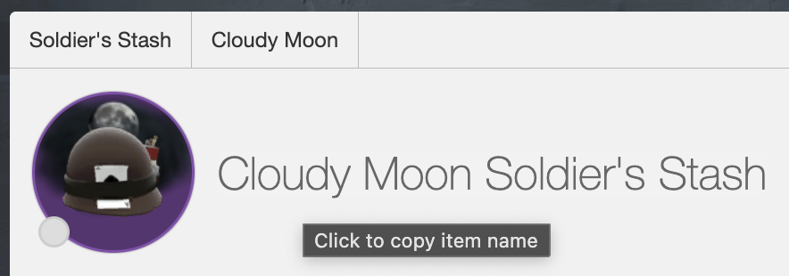
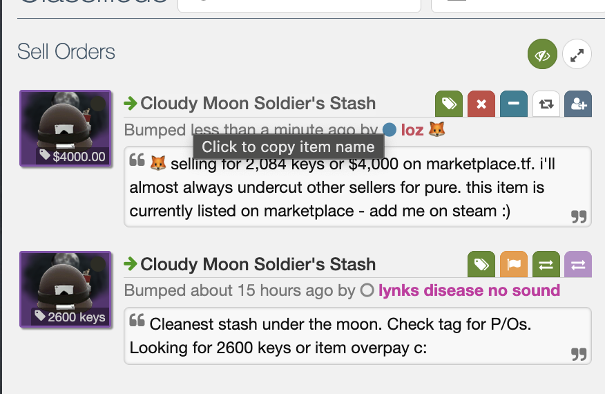

# Backpack.tf Item Name Copy

A Tampermonkey userscript that adds one-click copy functionality for TF2 item names on backpack.tf.

 | 

## Installation

1. Install [Tampermonkey](https://www.tampermonkey.net/) browser extension
2. Click [here to install the script](bp_item_name_copy.js) or copy the code manually
3. The script automatically activates on all backpack.tf pages

## Features

Click any of these elements on backpack.tf to instantly copy the item name to your clipboard:

- **Listing titles** - Click the item name in buy/sell listings
- **Stats page headers** - Click the main item title on item statistics pages
- **Hover popovers** - Click item names in tooltip popovers that appear on hover

## Debug Mode

Enable debug logging by running this in the browser console:

```javascript
window.BPTF_COPY_DEBUG = true;
```
